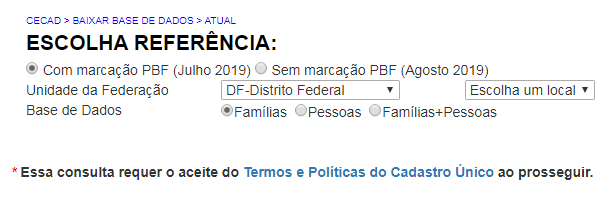

======================
Baixar
======================

Na aba “Baixar”, o município pode acessar a base de dados com
informações identificadas somente sobre famílias, somente sobre pessoas e
com informações sobre famílias e pessoas. Para acessar tais informações
sigilosas, é necessário aceitar o “Termo e Políticas do Cadastro Único”.

As opções do Menu Formulário BPC e Painel foram explicadas no início desse Manual.
Não deixe de conhecer as potencialidades dessa nova versão do Cecad!

