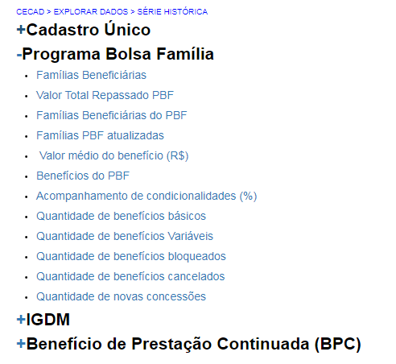
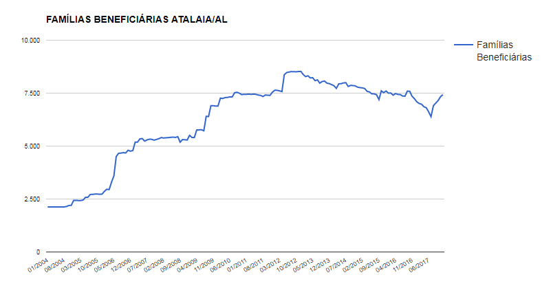

==========================
Programa Bolsa Família
==========================

Na opção **"Programa Bolsa Família"**  você terá informações sobre famílias beneficiárias do PBF; valor total dos benefícios; valor médio do benefício; valores e quantidades de benefícios básicos e variáveis; quantidade de benefícios bloqueados e cancelados; acompanhamento de condicionalidades; e quantidade de novas concessões de benefícios. Essas informações são apresentadas com os valores atuais e históricos, bem como com comparativos com maiores e menores valores do país e do estado.

O gráfico abaixo representa o histórico de famílias beneficiárias:

