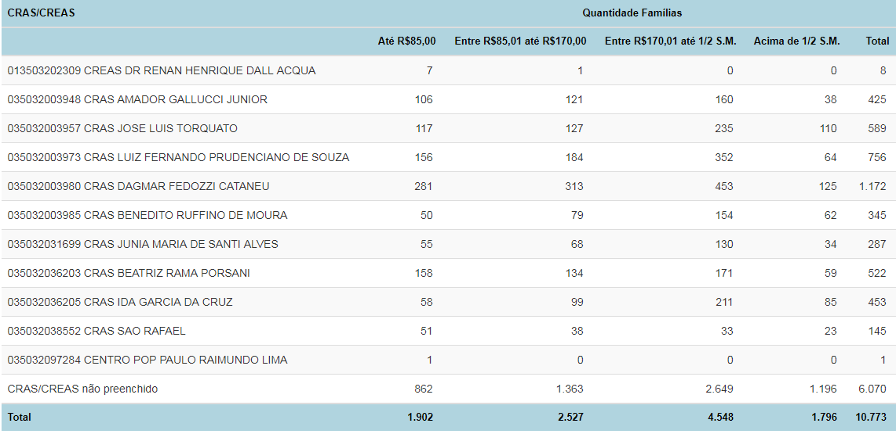
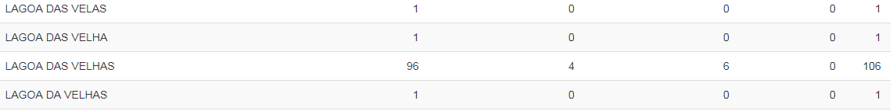

================================
CRAS/CREAS Localidade
================================

Essa funcionalidade identifica o número de famílias por CRAS/CREAS e por
localidade (campo 1.11 dos formulários do Cadastro Único). É uma
ferramenta muito útil para a organização das entrevistas com as famílias.

Vamos primeiro à opção **CRAS/CREAS**.

Essa ferramenta identifica o número de famílias por CRAS. Ela utiliza a
informação do campo 3.12 do Formulário, ou seja, se o município deixar
essa informação em branco, ela não vai servir para gerar o relatório por
CRAS.

Você pode também identificar as famílias com os seguintes perfis nos CRAS
e CREAS do seu município:

            * Estado cadastral da família
            * Faixa de renda familiar per capita
            * Faixa de renda familiar per capita das famílias atualizadas
            * Famílias em extrema probeza com/sem PBF
            * Grupos Populacionais Tradicionais e específicos
            * Número de famílias de indígenas cadastradas
            * Número de famílias por quantidade de meses após a última atualização cadastral
            * Número de famílias quilombolas cadastradas
            * Quantidade de famílias beneficiárias do Programa Bolsa Família

A partir desses relatórios, é possível identificar, por exemplo, quais são os
CRAS que atendem maior número de famílias em situação de extrema
pobreza ou com cadastros desatualizados.

A seguir, encontra-se um relatório gerado por essa funcionalidade:

**Nome da localidade**

A funcionalidade Nome da Localidade funciona da mesma forma, mas como
no Sistema de Cadastro Único ela é um campo aberto, ou seja, de livre
digitação, quem for analisar os dados gerados deverá dar um tratamento
adicional. Isso porque é comum que as pessoas escrevam o nome do
mesmo bairro de diferentes formas, e somente um técnico ou gestor local
será capaz de identificar quando se trata da mesma localidade ou não. Se o
técnico identificar que a mesma localidade foi registrada de diferentes
formas, e por isso, contada mais de uma vez, ele poderá simplesmente
somar todos os valores referentes às diferentes versões do nome do bairro.
No trecho abaixo é possível exemplificar esse caso:

É possível perceber, no exemplo acima, que provavelmente a localidade
‘Lagoa das Velhas’ foi escrita de cinco formas diferentes. O técnico que for
analisar esse relatório deverá juntar os valores referentes a cada uma das
versões do nome da localidade, somar os valores de todas elas para
encontrar o total de famílias cadastradas que moram nessa localidade.

