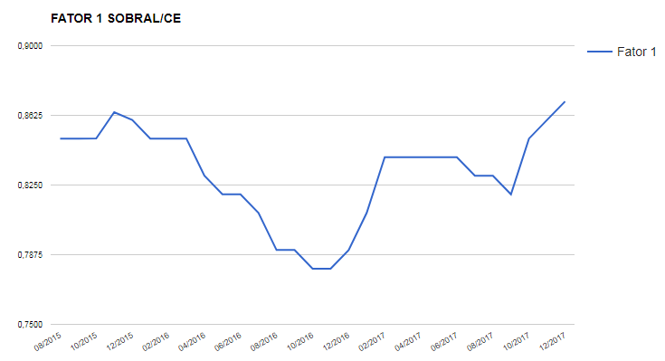

================
IGDM
================

Na opção **"IGDM"** você poderá verificar a evolução dos indicadores e dos repasses relacionados ao índice de Gestão Descentralizada Municipal, indicador que serve de base para o Ministério avaliar o desempenho da gestão do Cadastro único e programa Bolsa Família e, a partir desse desempenho, repassar recursos aos municípios e estados remunerando-os pelos resultados alcançados.

.. image:: img16cecad.png

Note que há dois tipos de relatório: IGDM antes de 2015 e depois de 2015.
Isso acontece porque em 2015 houve várias mudanças na fórmula de
cálculo do IGD. Nesta aba são apresentados os seguintes dados:

* **Valor repassado no Ano IGDM:** nessa opção, você verá a evolução dos valores totais dos incentivos recebidos no IGDM. Existem dois incentivos: um incentivo relacionado ao acompanhamento das famílias em descumprimento de condicionalidades, outro relacionado à atualização dos dados na gestão SigPBF.

        * Antes de 2015 havia mais dois incentivos, um relacionado ao número de cartões efetivamente entregues e outro relacionado à resposta dos municípios às demandas de fiscalização, esses dois nunca foram pagos, por isso, foram retirados da fórmula.

* **Fator 1:** nessa opção você verá a evolução total do indicador do IGDM, formado pelas taxas de atualização cadastral, taxa de acompanhamento de frequência escolar e taxa de acompanhamento da agenda da saúde.

        * Antes de 2015 ainda existia a **TCQC - Taxa de Cobertura Qualificada de Cadastros:** a taxa de cobertura qualificada de cadastros é o total de cadastros válidos dividido pela estimativa de famílias de baixa renda do município. Esse indicador parou de ser utilizado com a mudança nas regras do IGD de 2015.

* **TAC - Taxa de Atualização Cadastral:** a taxa de cobertura qualificada de cadastros é o total de cadastros atualizados dividido pelo total de cadastros do município.

        * Antes de 2015 havia uma checagem de cadastros válidos, mas com o aprimoramento do sistema de cadastramento, essa checagem passou a ser desnecessária, então, todos os cadastros com estado cadastral “cadastrado” passaram a ser considerados válidos.

* **TAFE - Taxa de Acompanhamento de Frequência Escolar:** a taxa de acompanhamento de frequência escolar é o número de crianças de famílias beneficiárias do PBF com informação de frequência escolar dividido pelo número total de crianças de famílias beneficiárias do PBF no município.

* **TAAS - Taxa de Acompanhamento de Agenda de Saúde:**  a taxa de acompanhamento da agenda da saúde é o número de famílias do PBF com perfil e com informação da agenda da saúde dividido pelo número de famílias beneficiárias do PBF com perfil saúde no município.

* **Valor Calculado com Incentivos:** nessa opção você poderá acompanhar o valor total repassado de agosto de 2015 até o último repasse realizado, considerando o valor referente às taxas do Fator 1 e aos incentivos.

Ao analisar a evolução do IGDM e das taxas que o compõem, você poderá
avaliar se os esforços que a gestão do Cadastro Único e PBF vêm fazendo
têm dado resultados. Caso você identifique alguma queda em algum dos
indicadores, é um alerta para que você verifique se existe algum problema
na execução das ações. O gráfico abaixo indica a evolução do Fator 1 (soma
dos indicadores que compõem o IGD) em um município definido:

