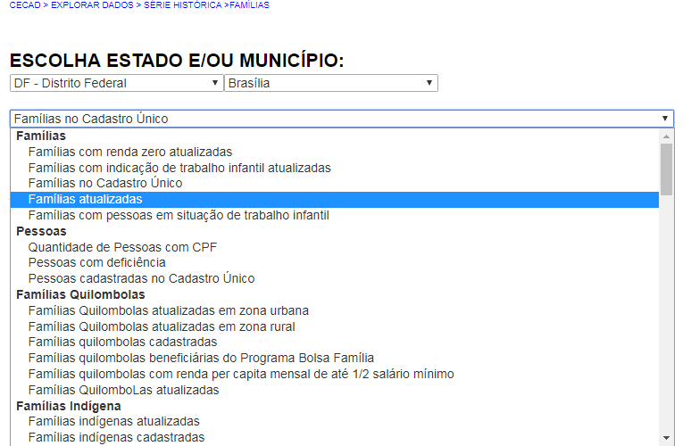

===========
Série Histórica
===========

Se você selecionar a opção **"Série histórica"**, terá as seguintes opções:

Basta selecionar o ícone **“+”** para que sejam abertos os relatórios específicos relativos a cada opção a partir do ano de 2006.

Ao fazer a busca por uma informação na funcionalidade Série Histórica, o
Cecad disponibiliza um menu com todas as opções de variáveis individuais,
de modo que você poderá acessar uma nova informação sem precisar clicar
no botão retornar:

