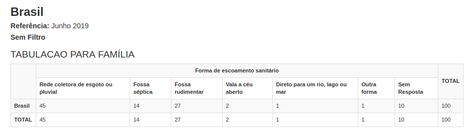
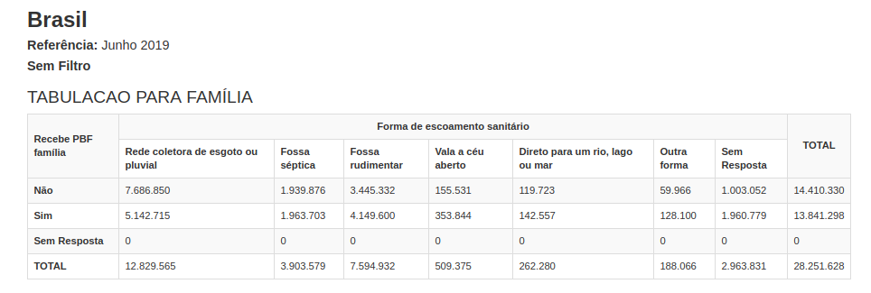
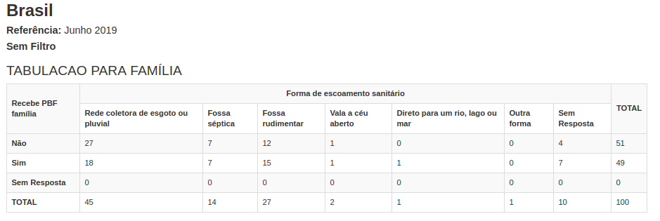
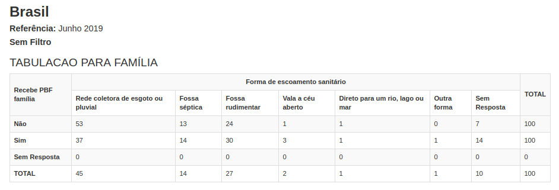

========
Gerando tabelas simples e cruzadas por meio do Tabcad
========

Vamos relembrar o menu **"TABCAD"**

O menu TABCAD já existia na versão anterior do Cecad e pode ser acessado
sem necessidade de login e senha. Ele permite gerar frequências simples, e
tabelas cruzadas e a aplicação de filtros. Os dados dessa funcionalidade não
são identificados, por isso, são abertos à consulta de todos.

A diferença entre uma **"tabela de frequência simples"** e uma tabela cruzada consiste no número de variáveis selecionadas. Para uma tabela de frequência simples, selecione apenas uma variável para a “coluna” e clique
no botão "Valor Absoluto”.

A seguir temos o resultado para variável “Bloco 2 – Forma de escoamento
sanitário”, detalhando que quase 13 milhões declaram possuir “Rede
coletora de esgoto ou pluvial” enquanto mais de 8 milhões declaram possuir
“Fossa rudimentar”, “Vala a céu aberto” ou “Direto para um rio, lago ou
mar”.

.. image:: img4cecad.png

Ao clicar no botão “% Total” é possível ver os valores em porcentagem (%).
O exemplo abaixo mostra que 45% das famílias do Cadastro Único declaram
ter Rede Coletora de esgoto ou pluvial, e outros 45% declaram ter fossa
séptica, rudimentar, vala a céu aberto, escoamento direto em um rio, lago,
mar ou outra forma, enquanto 10% não responderam.

Já para criar uma tabela cruzada, selecione uma variável para "coluna", outra variável para "linha" e clice no botão "Valor Absoluto".

No exemplo abaixo, temos o resultado para variável “Bloco 2 – Forma de
escoamento sanitário” e “Bloco 4 – Recebe Bolsa Família”. A partir deste
cruzamento, temos que quase de 8 milhões “Não recebem PBF” e declaram
possuir “Rede coletora de esgoto ou pluvial” enquanto pouco mais de 5
milhões Recebem PBF e declaram possuir “Rede coletora de esgoto ou
pluvial”.

Ao clicar no botão “% Total” temos os valores representados em
percentuais. Veja o resultado abaixo, 27% das famílias do Cadastro Único
não recebem Bolsa Família e possuem "Rede coletora de esgoto ou pluvial",
já 18 por centro recebem PBF e declaram possuir “Rede coletora de esgoto
ou pluvial”.

Ao clicar no botão “% Linha” é possível fazer a análise percentual por linha.
Veja no exemplo abaixo que, das famílias que “Não Recebem PBF”, 53%
possuem “Rede coletora de esgoto ou pluvial”, ao passo que das famílias
que “Recebem PBF” apenas 37% possuem “Rede coletora de esgoto ou
pluvial”. Se analisarmos a resposta "Fossa rudimentar" é possível notar uma
diferença de 6 pontos percentuais a mais para quem “Recebe PBF”. Isso
mostra que as famílias do Bolsa Família estão em situação mais crítica de
vulnerabilidade a respeito do tema saneamento básico.

Ao clicar no botão “% Coluna”, é possível fazer a análise percentual por
coluna. Veja no exemplo abaixo coluna a coluna. Nota-se que apenas a
resposta “Rede coletora de esgoto ou pluvial” possui proporção maior de
famílias que não recebem PBF. A resposta “Fossa séptica” possui proporção
igual para PBF e não PBF, e as demais respostas todas possuem maior
proporção de famílias do Bolsa Família. Essa proporção é muito maior
inclusive na opção "Sem Resposta", pois devido à vulnerabilidade crítica
dessas famílias muitas nem respondem.

